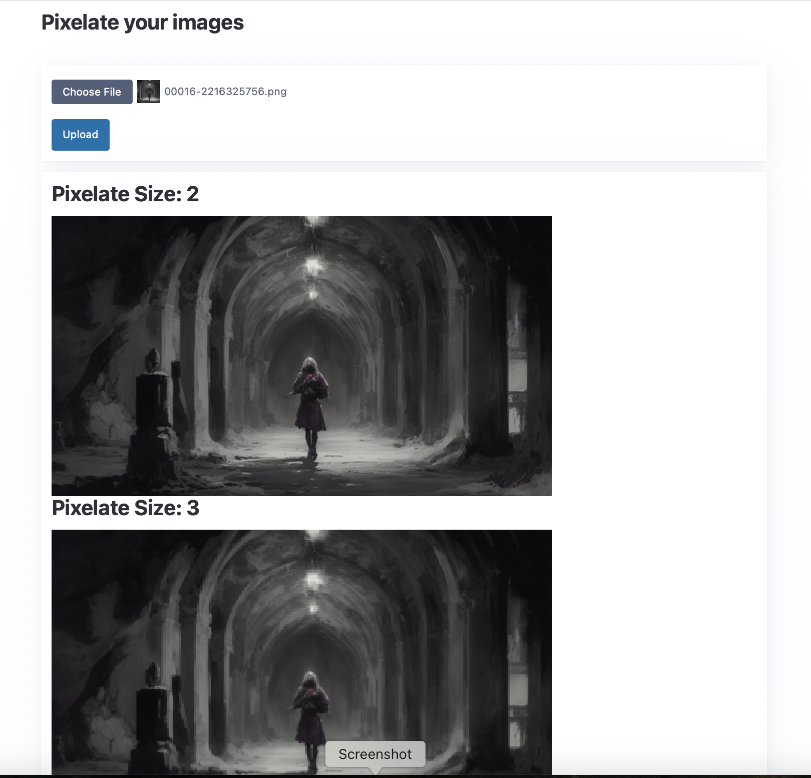
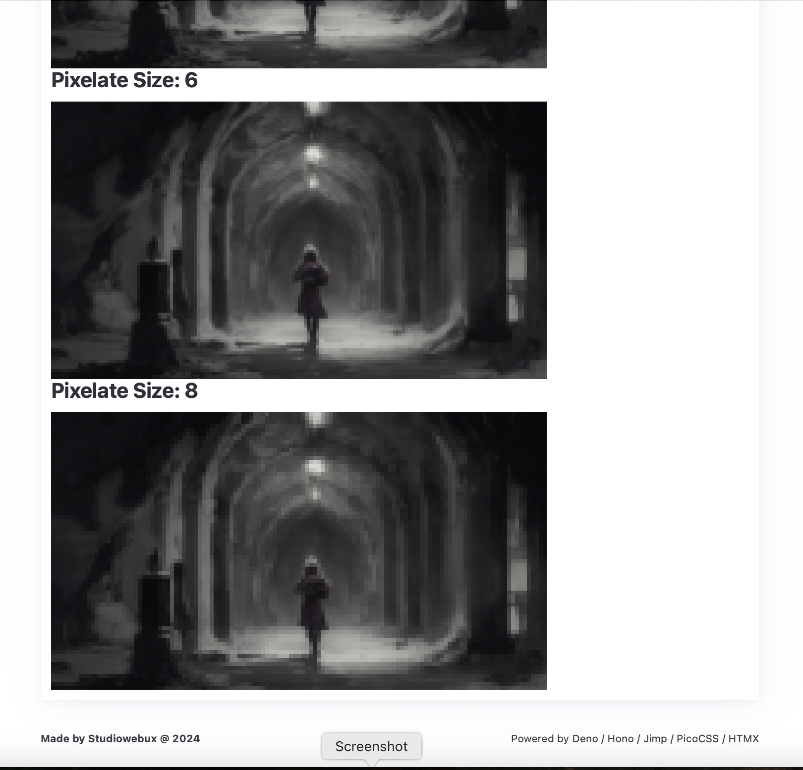

<div align="center">

<h2>Pixel-it</h2>

<p>A Deno Web Based Application to pixelate your images</p>

<p align="center">
  <a href="https://github.com/studiowebux/pixel-it/issues">Report Bug</a>
  ·
  <a href="https://github.com/studiowebux/pixel-it/issues">Request Feature</a>
</p>
</div>

---

## About

Simple tool build with Jimp to pixelate images.

### Screenshots




---

## Installation and Usage

1. Install deno: https://deno.com (*Tested with Deno 2*)
2. `deno serve --watch server.ts`
3. Navigate to `http://localhost:8000`
4. Upload your image
5. You will get multiple versions (2, 3, 4, 5, 6, 8 pixels)
6. Voila !

---

### Releases and Github Actions

```bash
git tag -a X.Y.Z -m "Version X.Y.Z"
git push origin tags/X.Y.Z
```

---

## Contributing

1. Fork the project
2. Create a Feature Branch
3. Commit your changes
4. Push your changes
5. Create a PR

<details>
<summary>Working with your local branch</summary>

**Branch Checkout:**

```bash
git checkout -b <feature|fix|release|chore|hotfix>/prefix-name
```

> Your branch name must starts with [feature|fix|release|chore|hotfix] and use a / before the name;
> Use hyphens as separator;
> The prefix correspond to your Kanban tool id (e.g. abc-123)

**Keep your branch synced:**

```bash
git fetch origin
git rebase origin/master
```

**Commit your changes:**

```bash
git add .
git commit -m "<feat|ci|test|docs|build|chore|style|refactor|perf|BREAKING CHANGE>: commit message"
```

> Follow this convention commitlint for your commit message structure

**Push your changes:**

```bash
git push origin <feature|fix|release|chore|hotfix>/prefix-name
```

**Examples:**

```bash
git checkout -b release/v1.15.5
git checkout -b feature/abc-123-something-awesome
git checkout -b hotfix/abc-432-something-bad-to-fix
```

```bash
git commit -m "docs: added awesome documentation"
git commit -m "feat: added new feature"
git commit -m "test: added tests"
```

</details>

## License

Distributed under the MIT License. See LICENSE for more information.

## Contact

- Tommy Gingras @ tommy@studiowebux.com | Studio Webux

<div>
<b> | </b>
<a href="https://www.buymeacoffee.com/studiowebux" target="_blank"
      ></a>
<b> | </b>
<a href="https://webuxlab.com" target="_blank"
      > Webux Lab</a>
<b> | </b>
</div>
